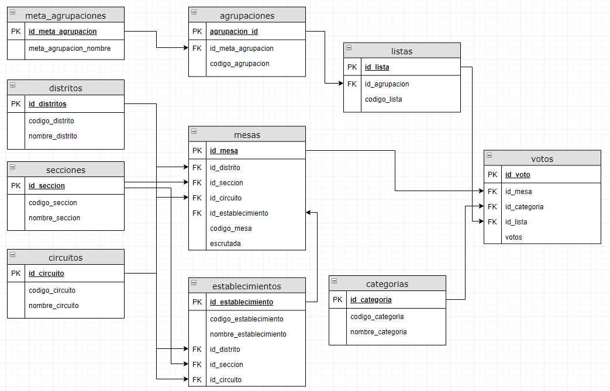

<!-- badges: start -->
  
<!-- badges: end -->

# elecciones.ar.2019

Paquete de datos con los resultados del escrutinio de las "Elecciones Nacionales 2019" de Argentina, tal cual como los publica la **[Dirección Nacional Electoral (DINE)](https://www.argentina.gob.ar/interior/dine)**. Este paquete se puede complementar con el de las [paso2019](https://github.com/pmoracho/paso2019).

## Contenido

### Datos

Los datos están actualizados al `28/10/2019 02:46 AM (-03:00 UTC)` según informa la **DINE**.

#### Modelo original

El modelo original representa las tablas originales distribuidas por la justicia electoral, tal cual se pueden acceder desde: https://resultados2019.gob.ar/resultados_detalle.zip. Los archivos (de tipo DSV), fueron importados sin ninguna transformación importante, son `data.frames` básicos, la mayoría de las columnas son `character`, salvo las que representan cantidades de votos que son numéricas.

* descripcion_postulaciones (145.9 Kb)
* descripcion_regiones (522 kb)
* mesas_totales (81.3 mb)
* mesas_totales_agrp_politicas (64.9 mb)
* medios_sim_leg_nac (6.3 Kb)

Requerimiento de memoria total: **146.9 Mb**

#### Modelo nuevo

Son tablas derivadas de las anteriores. La idea es transformar los datos en tablas que respeten mejor un modelo relacional. Estas tablas están en pleno procesos de creación y modificación, eventualmente podrá cambiar algo.

* agrupaciones (7 kb)
* categorias (38.7 kb)
* circuitos (496.2 Kb)
* distritos (2.6 kb)
* listas (104.5 kb)
* mesas (6.9 mb)
* meta_agrupaciones (4.5 kb)
* secciones (40.5 kb)
* votos (47.3 MB)
* establecimientos (1.7 Mb)

Requerimiento de memoria total: **56.5 Mb**

Este modelo elimina mucha de la redundancia de datos de los archivos originales, se generaron también `id's` numéricos para cada tabla, y así reducir los requerimientos de memoria. Claro, que las consultas requieren ir agregando varias relaciones. Por ejemplo, para consultar el total de votos de cada agrupación en la elección de presidente, habría que hacer algo así:

    library("tidyverse")
    library("elecciones.ar.2019")
    
    votos %>% 
      left_join(listas, by = "id_lista") %>% 
      left_join(agrupaciones, by = "id_agrupacion") %>% 
      left_join(categorias, by = "id_categoria") %>% 
      left_join(meta_agrupaciones, by = "id_meta_agrupacion") %>% 
      filter(nombre_categoria == "Presidente y Vicepresidente de la República") %>% 
      group_by(nombre_meta_agrupacion, votos_totales) %>% 
      summarise(votos = sum(votos)) %>% 
      mutate(porcentaje = votos / votos_totales) %>% 
      select(nombre_meta_agrupacion, votos, porcentaje ) %>% 
      arrange(-votos)
      
    # A tibble: 7 x 3
      nombre_meta_agrupacion                            votos porcentaje
      <chr>                                             <dbl>      <dbl>
    1 FRENTE DE TODOS                                12473709     0.481 
    2 JUNTOS POR EL CAMBIO                           10470607     0.404 
    3 CONSENSO FEDERAL                                1599707     0.0617
    4 VOTOS en BLANCO                                  758988     0.0293
    5 FRENTE DE IZQUIERDA Y DE TRABAJADORES - UNIDAD   561214     0.0216
    6 FRENTE NOS                                       443507     0.0171
    7 UNITE POR LA LIBERTAD Y LA DIGNIDAD              382820     0.0148

Los procesos de importación, tanto de los archivos, como los de la "captura" de los datos de la web, como así también la creación del nuevo modelo, puede consultarse y verificarse mirando los scripts (en el orden de ejecución):

* `tools/download_and_process_establecimientos.R`: descarga y procesa todos los archivos `json` para generar la tabla de `scrap_establecimientos_mesas`, dónde tenemos código de mesa y nombre del establecimiento
* `tools/process_dsv_and_create_model.R`: Procesamos los DSV originales, para crear las tablas originales y el nuevo modelo

### Funciones

* **get_telegrama_url()**: Para generar la url de la imagen digitalizada del telegrama
* **view_telegrama()**: Para ver la imagen del telegrama

## Instalación

Como cualquier otro paquete mantenido en github.com, el proceso es relativamente sencillo. En primer lugar necesitaremos `devtools`:

    install.packages("devtools")

una vez instalada este paquete, simplemente podremos instalar `elecciones.ar.2019` directamente desde el código fuente del repositorio:

    devtools::install_github("pmoracho/elecciones.ar.2019")

## Requerimientos

Ninguno en particular, salvo `devtools` para poder instalar este paquete, son datos, y eventualmente alguna que otra función que en principio intentaré que no requiera ningún paquete extra. 

## Actualizaciones

* 2019/11/02 - Inicio del proyecto
